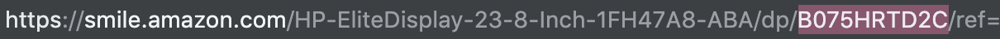

# PriceDrop

Compares current deals for an amazon product with historic prices, and notifies the user in case of a good deal

## Use

Run python3 price_drop.py

For information, run python3 price_drop.py -h

Use arguments: 
- The product's Amazon Standard Identification Number, eg "B075HRTD2C"
    
- Condition, eg new, used, usedAcceptable, usedGood, usedVeryGood
- Shipping, eg prime, freeShipping, primeOrFree, all
- Email: your email address
- Interval: how many minutes between iterations. Recommend: 8 hours = 8 * 60 = 480

If no arguments are supplied, the user will be prompted for them.

The application will then scrape Amazon.com for the best prices, and store them in a local database.

If a listing is significantly cheaper than competitor's prices and past offerings, an email will be sent to your address.

This process will repeat at the given interval until the program is manually stopped.

Currently, only one item can be tracked per running process. This will be updated in the future.

## Development

Written in Python.

Dependencies: 
- BeautifulSoup and requests for web scraping
- pandas for data management
- sqlite3 for Database queries
- smtplib for SMTP and emails
- my utilities package for progress bars, countdowns, etc.

## Author

Noah Tigner

nzt@cs.uoregon.edu
